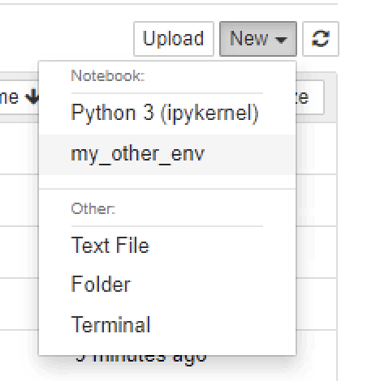
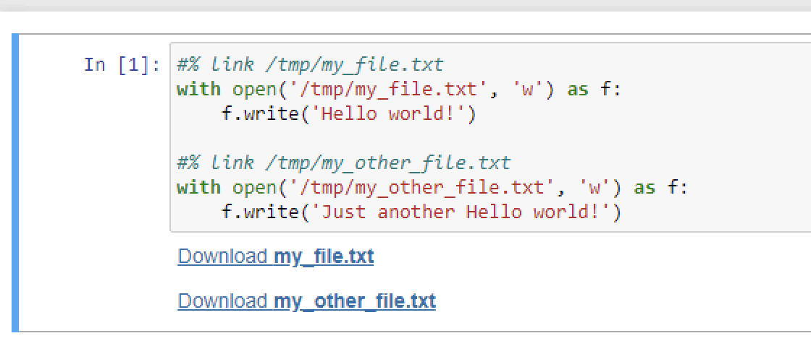

## Installation

1. Consider we have an empty environment - install `miniconda` and a `jupyter notebook`
```
wget -q "https://repo.anaconda.com/miniconda/Miniconda3-latest-Linux-x86_64.sh" -O /tmp/Anaconda_Install.sh && \
bash /tmp/Anaconda_Install.sh -f -b -p ~/conda && \
rm -f /tmp/Anaconda_Install.sh && \
source ~/conda/etc/profile.d/conda.sh && \
conda activate base && \
pip install notebook
```
2. Install `JupyterFileDownloader` extension
```
git clone https://github.com/sidoruka/jupyter-file-downloader && \
cd jupyter-file-downloader && \
pip install .
```

3. Enable `JupyterFileDownloader` extension (we can try an [automated enablement](https://jupyter-notebook.readthedocs.io/en/stable/examples/Notebook/Distributing%20Jupyter%20Extensions%20as%20Python%20Packages.html#Automatically-enabling-a-server-extension-and-nbextension) as well)
```
jupyter nbextension install --py JupyterFileDownloader --sys-prefix && \
jupyter nbextension enable --py JupyterFileDownloader --sys-prefix && \
jupyter serverextension enable --py JupyterFileDownloader --sys-prefix
```

4. Create another conda environment and register ipython kernel, to test that the extension works fine outsie of the `base` environment
```
conda create -y -n my_other_env python=3.9 && \
conda activate my_other_env && \
pip install ipykernel && \
python -m ipykernel install --name my_other_env
```

5. Start the notebook (set the `<base_url>` accordingly)
```
conda activate base && \
jupyter notebook --ip '0.0.0.0' \
                 --port 8080 \
                 --no-browser \
                 --NotebookApp.token='' \
                 --NotebookApp.notebook_dir=/ \
                 --NotebookApp.base_url=<base_url> \
                 --allow-root
```

## Usage

1. Create a new notebook using `my_other_env` kernel


2. Write a couple of files and annotate them with `#% link <filepath>`

```
#% link /tmp/my_file.txt
with open('/tmp/my_file.txt', 'w') as f:
    f.write('Hello world!')

#% link /tmp/my_other_file.txt
with open('/tmp/my_other_file.txt', 'w') as f:
    f.write('Just another Hello world!')
```

3. Enjoy downloadable links in the outputs
